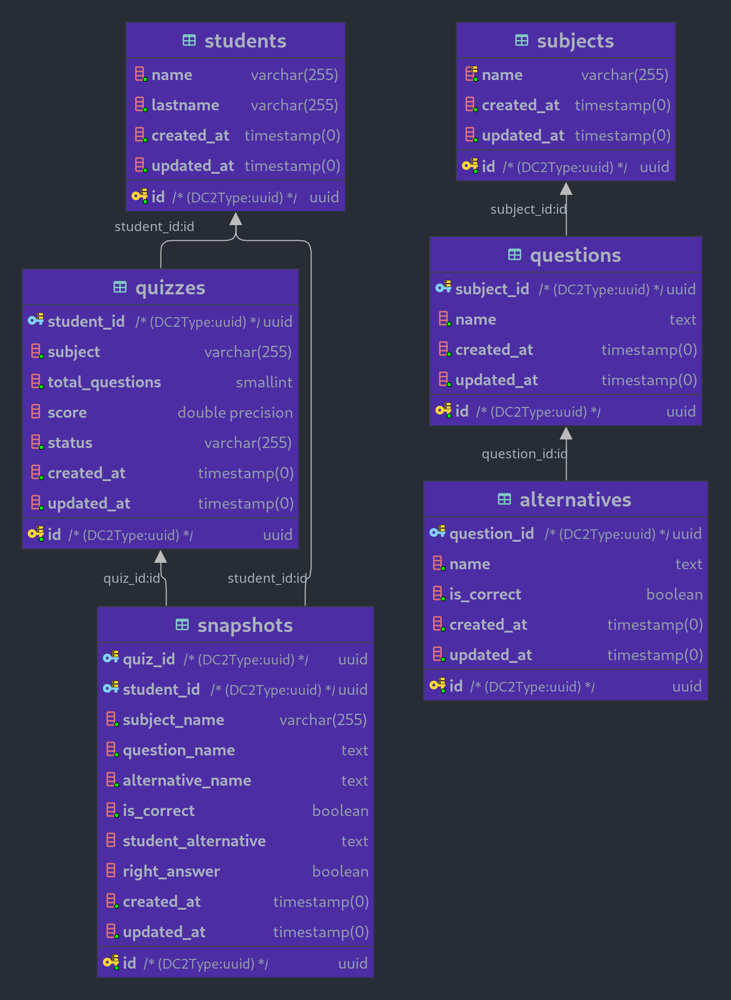

# Projeto Quiz
[](https://github.com/eaojunior/agz-laravel-quiz-project/actions/workflows/laravel.yml)

## Contextualização
Bem-vindo ao meu projeto de desenvolvimento pessoal.

Esse projeto foi desenvolvido em cima de alguns requisitos.
Você pode encontrá-los [aqui](Projeto_PDI_-_Sistema_de_Provas_(Quiz).pdf).

## 📋 Pré-requisitos
* docker
* docker-compose

## 🔧 Instalação
Clone o projeto e entre em seu diretório

### Iniciando o container pela primeira vez
```sh
make build-and-serve
```

### Levante o container (válido apenas se já iniciou o container pela primeira vez)
```sh
make serve
```

## 🚀 Implantação

### Gere a chave da aplicação
```sh
make key-generate 
```

## ⚙️ Executando os testes
```sh
make all-tests
```
OU
```sh
make test {nomeDoTeste}
```

## Modelagem e relacionamento das entidades


## Regras para smoke test
Antes de seguir adiante, eis aqui algumas regras de negócio adotas para esse projeto (além daquelas já descritas no documento anexado):

* (Opcional) Importe esse [arquivo](Insomnia-All_2022-10-14.json) de configuração no Insomnia para facilitar os testes
* No momento não é possível editar perguntas, alternativas ou provas;
* Cada questão deve ter no máximo 4 alternativas e todas devem ser cadastradas ao mesmo tempo;
* Cada prova gerada tem entre 5 e 10 questões;
* Cada estudante não pode resolver mais de uma prova ao mesmo tempo, ou seja, não é possível gerar uma prova para Xoxana Neves se ela já tem uma prova em estado ABERTO;
* Conecte o banco local em seu PHPStorm ou DataGrip (informações no `.env` ou no `docker-compose`)
* rode os comandos:
```sh
make schema-update && make run db:seed
```
* Regras para requisições (cadastro de estudantes, questões etc ...)

```json
url = localhost:9999/api

POST /students => 201 CREATED


bodyRequest = {
  "name": "Flavin",
  "lastName": "Do Pneu"
}

POST /subjects => 201 CREATED

bodyRequest = {
  "name": "Laravel"
}

POST /questions => 201 CREATED

bodyRequest = {
  "name": "Qual a formula do comprimento de uma circunferencia?",
  "subjectName": "matematica"
}

GET /questions/{question} => 200 OK

POST /questions/{question}/alternatives => 201 CREATED

bodyRequest = [
    {
        "name": "php artisan doctrine:schema:update",
        "isCorrect": true
    },
    {
        "name": "php artisan doctrine:schema:download",
        "isCorrect": false
    },
    {
        "name": "php artisan doctrine:schema:up",
        "isCorrect": false
    },
    {
        "name": "php artisan doctrine:schema:down",
        "isCorrect": false
    }
]

POST /students/{student}/quizzes => 201 CREATED

PUT /quizzes/{quizz} => 200 OK

bodyRequest = [
    {
        "name": "What are Requests in Laravel?",
        "answer": "Requests are a way to validate incoming HTTP requests"
    },
    ...
]

Obs.: O tamanho do array deve ser igual ao total de perguntas do quizz.
```

> Caso precise fazer o drop do banco por algum motivo:
```sh
make drop-db
```

## Pontos de melhoria do projeto
* Substituir o atributo nome de alternativa para descrição;
* Criar uma tabela de snapshot diferente, com id do quiz e descrição da pergunta (`snapshot_quiz_questions`) e uma outra tabela com o id do quiz e descrição das alternativas (`snapshot_quiz_alternativas`). Acho que seria melhor do que apenas uma tabela `snapshot`;
* Melhorias de design em geral;
* Melhorias na documentação (fiz correndo de última hora);
* Implementação de mais testes (unitário e integração).

## 🛠️ Construído com
O boilerplate desse projeto foi construído com as seguintes ferramentas:

* [AmazonLinux](https://hub.docker.com/_/amazonlinux/)
* [Laravel](https://laravel.com/)
* [PHP 8.0.20](https://hub.docker.com/_/php?tab=tags)

## ✒️ Autores

* **Thiago Oliveira** - *Trabalho Inicial do boilerplate*
* **Erivaldo Jr** - *Trabalho Inicial do boilerplate*
* **Ernesto Amorim** - *Adaptação do boilerplate para Github público* 
* **Lucas Neves** - *Desenvolvimento do projeto* 
